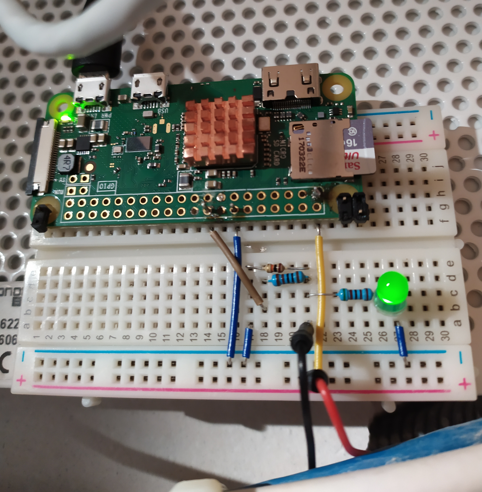

<p align="center">
  
</p>

# Features
* works with Raspberry Pi Zero W
* async, modular and failsafe (except power outage)
* automatic log upload to Dropbox (with retry mechanism)
* door sensor support detects when doors are opened or closed (incl. onboard LED indication)
* WLAN scanner detects and logs devices outside whitelist
* SMS/E-mail notification\* (with retry mechanism)
* arm/disarm by cron expressions
* rolling logs support

\*email password read in runtime, but stored encrypted

# Preparation
It is recommended to create a dedcated email account for the notifications (you can also forward emails to your main account). Email password should be stored as binary base64 encoded UTF-8 string in file *gmail_pass.b*

# Installation 
run on startup with crontab

``` crontab -e ```

Add line which runs the program. Using tmux to exectue and detach from 
the process so it can run in background.
python3 is /usr/bin/python3 and it points to /usr/local/bin/python3.6
NOTE using "python3.6" command istead of "python3" did not work.

``` @reboot sleep 10 && tmux new -d "python3 /home/pi/sechome/sechome.py" ```

# Dependencies
* DropboxUploader https://github.com/andreafabrizi/Dropbox-Uploader
* Mock gpio taken from https://github.com/sebastian-tschen/pishutter/tree/master/mock_gpio
* Notable pypi packages: pycron, smtp, email, asyncio

# TODO
* prettify Wifi logs
* remote (dropbox hosted) system arming config
* atomatic tests


**NOTE:**
There is no detailed documentation for this project. It's been tested only manualy. To understand how this system works you need to **read the code**.
